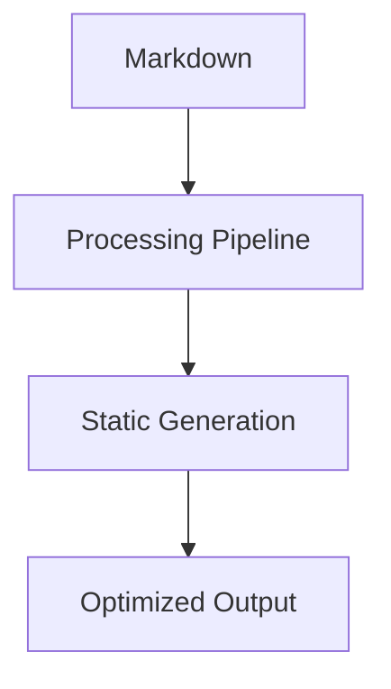

# Rovani.net - Next.js Implementation

## Overview

This repository represents my experimental approach to learning modern web technologies through practical application. Rather than building toy projects, I periodically rewrite my personal blog/website using different frameworks to gain hands-on experience with emerging technologies and architectural patterns.

## Why This Codebase Exists

**Learning Through Production**: This codebase serves as my laboratory for exploring Next.js 15, React 18, and modern web development practices. By rebuilding a real website with actual content and traffic, I encounter and solve authentic problems that don't arise in tutorial projects.

**Framework Exploration History**: This is one iteration in a series of rewrites across different technologies (previous versions used Jekyll, Hugo, custom PHP, and other frameworks). Each rewrite teaches me the strengths, limitations, and architectural decisions inherent to different approaches.

**Content Portability**: The content layer is intentionally decoupled as a git submodule ([rovaninet-posts](https://github.com/drovani/rovaninet-posts)), allowing the same 500+ blog posts to be reused across different framework implementations. This separation enables rapid prototyping of new technologies while maintaining content consistency and simplifying migrations between platforms.

**Experimental Features**: You'll find evidence of experimentation throughout - from advanced markdown processing pipelines to custom routing patterns to performance optimization techniques. This reflects my process of testing ideas and learning what works in practice.

## Technical Implementation Highlights

### Architecture Decisions Worth Noting

- **Decoupled Content Architecture**: Content stored as a git submodule ([rovaninet-posts](https://github.com/drovani/rovaninet-posts)) enabling reuse across multiple website implementations and frameworks
- **File-based Content Management**: Chose markdown over a headless CMS to experiment with static generation at scale (500+ posts)
- **Advanced Markdown Processing**: Built a sophisticated content pipeline using the unified/remark/rehype ecosystem to handle complex content transformations
- **Performance-First Approach**: Implemented comprehensive static generation with strategic dynamic routing for optimal Core Web Vitals
- **SEO-Focused Design**: Custom sitemap generation and URL structure designed for search engine optimization

### Advanced Markdown Features

This implementation includes comprehensive support for technical writing and rich content:

#### Syntax Highlighting
```typescript
// Automatic language detection and highlighting
const example = {
  language: 'typescript',
  features: ['line numbers', 'copy button', 'theme support']
};
```

#### Mathematical Expressions
Inline math: $E = mc^2$ and block equations:

$$\int_{-\infty}^{\infty} e^{-x^2} dx = \sqrt{\pi}$$

#### Interactive Diagrams


#### Enhanced Content Features
- [x] Task lists with interactive checkboxes
- [x] Emoji shortcode support :rocket:
- [x] Enhanced tables with responsive design
- [x] Improved blockquotes and typography
- [x] Performance-optimized component rendering

**Supported Languages**: TypeScript, JavaScript, Python, Bash, SQL, YAML, JSON, CSS, PHP, Java, C#, Go, Rust, Ruby, and more.

**Content Processing**: 
- Math rendering via KaTeX with LaTeX syntax
- Mermaid diagrams for flowcharts, sequence diagrams, state machines
- GitHub Flavored Markdown with extensions
- Optimized for performance with code splitting and lazy loading

### Modern Tooling Integration

- **Next.js 15 with Turbopack**: Early adoption of cutting-edge build tools
- **TypeScript Configuration**: Pragmatic setup balancing type safety with development velocity
- **TailwindCSS Implementation**: Utility-first CSS with custom design system
- **Deployment Automation**: Netlify integration with sophisticated redirect management

## Code Quality & Patterns

This codebase demonstrates practical software engineering skills:

- **Clean Architecture**: Separation of concerns between content processing, UI components, and routing logic
- **Type Safety**: Strategic TypeScript usage for critical data structures
- **Performance Optimization**: Image optimization, static generation, and build-time optimizations
- **Maintainable Code**: Consistent patterns and conventions throughout the codebase

## Learning Outcomes

Through this project, I've gained practical experience with:
- Server-side rendering and static site generation trade-offs
- Content management system design decisions
- Modern React patterns and Next.js best practices
- Performance optimization in production environments
- SEO implementation in modern web applications

## Future Employers: What This Shows

This repository demonstrates my approach to continuous learning and practical skill development. Rather than just following tutorials, I apply new technologies to real-world problems, learning through experimentation and iteration. The experimental nature reflects my commitment to staying current with evolving web technologies and my ability to rapidly adapt and learn new frameworks.
