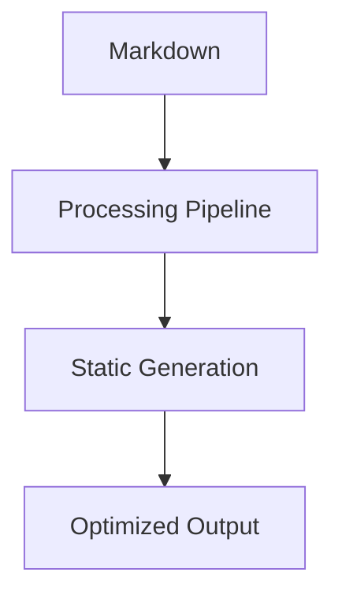

# Rovani.net - Next.js Implementation

## Overview

This repository represents my experimental approach to learning modern web technologies through practical application. Rather than building toy projects, I periodically rewrite my personal blog/website using different frameworks to gain hands-on experience with emerging technologies and architectural patterns.

## Why This Codebase Exists

**Learning Through Production**: This codebase serves as my laboratory for exploring Next.js 15, React 18, and modern web development practices. By rebuilding a real website with actual content and traffic, I encounter and solve authentic problems that don't arise in tutorial projects.

**Framework Exploration History**: This is one iteration in a series of rewrites across different technologies (previous versions used Jekyll, Hugo, custom PHP, and other frameworks). Each rewrite teaches me the strengths, limitations, and architectural decisions inherent to different approaches.

**Content Portability**: The content layer is intentionally decoupled as a git submodule ([rovaninet-posts](https://github.com/drovani/rovaninet-posts)), allowing the same 500+ blog posts to be reused across different framework implementations. This separation enables rapid prototyping of new technologies while maintaining content consistency and simplifying migrations between platforms.

**Experimental Features**: You'll find evidence of experimentation throughout - from advanced markdown processing pipelines to custom routing patterns to performance optimization techniques. This reflects my process of testing ideas and learning what works in practice.

## Technical Implementation Highlights

### Getting It Workin

In order to build the application from a fresh Windows + WSL2 instance:

1. Install nvm: `curl -o- https://raw.githubusercontent.com/nvm-sh/nvm/v0.40.3/install.sh | bash`
1. Restart bash
1. Install latest node: `nvm install --lts`
1. Update npm: `npm -g install npm`
1. Install npm packages: `npm i`
1. Initialize git submodules: `git submodules init`
1. Update the git submodules: `git submodules update`
1. Build the application: `npm run build`

If everything was done correctly, the build will succeed and all is well!

### Architecture Decisions Worth Noting

- **Decoupled Content Architecture**: Content stored as a git submodule ([rovaninet-posts](https://github.com/drovani/rovaninet-posts)) enabling reuse across multiple website implementations and frameworks
- **File-based Content Management**: Chose markdown over a headless CMS to experiment with static generation at scale (500+ posts)
- **Advanced Markdown Processing**: Built a sophisticated content pipeline using the unified/remark/rehype ecosystem to handle complex content transformations
- **Performance-First Approach**: Implemented comprehensive static generation with strategic dynamic routing for optimal Core Web Vitals
- **SEO-Focused Design**: Custom sitemap generation and URL structure designed for search engine optimization

### Content Frontmatter Schema

Blog posts are stored in the [rovaninet-posts](https://github.com/drovani/rovaninet-posts) submodule using the naming convention `rovaninet-posts/{YYYY}/{YYYY-MM-DD}-{slug}.md`. The date and slug are extracted from the filename, producing URLs like `/posts/{year}/{slug}`.

#### Frontmatter Fields

| Field | Type | Required | Description |
|-------|------|----------|-------------|
| `title` | string | Yes | Post headline |
| `date` | string | Yes | Publication date in ISO format (`YYYY-MM-DD`) |
| `excerpt` | string | No | Summary text displayed in post listings. Auto-generated from the first paragraph if omitted |
| `category` | string | No | Single category name; generates listing pages at `/category/{slug}` |
| `series` | string | No | Series name for multi-part posts; generates listing pages at `/series/{slug}` |
| `step` | number | No | Numeric position within a series |
| `tags` | string[] | No | List of tags; each generates a listing page at `/tag/{slug}` |
| `meta_description` | string | No | SEO meta description (ideal: 150-160 chars). Falls back to `excerpt` truncated to 160 characters |
| `image` | string | No | Featured image path relative to `/public/` (e.g., `/images/posts/my-post.jpg`). Used for Open Graph and Twitter Card previews |
| `imageAlt` | string | No | Alt text for the featured image |

#### Post Organization

- **Category** (one per post): Groups posts by topic. Example: `category: "Career in Transition"`
- **Series + Step** (one per post, ordered): Links related posts in sequence. Example: `series: "Hero Wars"` with `step: 3`
- **Tags** (many per post): Cross-cutting labels. Example: `tags: [github, projectmanagement, sideprojects]`

#### Example Frontmatter

```yaml
---
title: "Beyond the Repository: Leveraging GitHub Features"
category: Career in Transition
excerpt: "Transitioning between roles offers the perfect opportunity..."
meta_description: "How to use GitHub Projects, Issues, and Milestones to manage side projects during career transitions."
image: /images/posts/github-features-og.jpg
imageAlt: "GitHub project board with milestone tracking"
tags:
  - github
  - projectmanagement
  - ctointransition
date: 2025-03-19
---
```

Minimal frontmatter (only required fields):

```yaml
---
title: "A Word On Factory Results and Contracts"
date: 2016-09-17
---
```

### Advanced Markdown Features

This implementation includes comprehensive support for technical writing and rich content:

#### Syntax Highlighting
```typescript
// Automatic language detection and highlighting
const example = {
  language: 'typescript',
  features: ['line numbers', 'copy button', 'theme support']
};
```

#### Mathematical Expressions
Inline math: $E = mc^2$ and block equations:

$$\int_{-\infty}^{\infty} e^{-x^2} dx = \sqrt{\pi}$$

#### Interactive Diagrams

```mermaid
graph TD
    A[Markdown] --> B[Processing Pipeline]
    B --> C[Static Generation]
    C --> D[Optimized Output]
```

#### Enhanced Content Features
- [x] Task lists with interactive checkboxes
- [x] Emoji shortcode support :rocket:
- [x] Enhanced tables with responsive design
- [x] Improved blockquotes and typography
- [x] Performance-optimized component rendering

**Supported Languages**: TypeScript, JavaScript, Python, Bash, SQL, YAML, JSON, CSS, PHP, Java, C#, Go, Rust, Ruby, and more.

**Content Processing**: 
- Math rendering via KaTeX with LaTeX syntax
- Mermaid diagrams for flowcharts, sequence diagrams, state machines
- GitHub Flavored Markdown with extensions
- Optimized for performance with code splitting and lazy loading

### Modern Tooling Integration

- **Next.js 15 with Turbopack**: Early adoption of cutting-edge build tools
- **TypeScript Configuration**: Pragmatic setup balancing type safety with development velocity
- **TailwindCSS Implementation**: Utility-first CSS with custom design system
- **Deployment Automation**: Netlify integration with sophisticated redirect management

## Code Quality & Patterns

This codebase demonstrates practical software engineering skills:

- **Clean Architecture**: Separation of concerns between content processing, UI components, and routing logic
- **Type Safety**: Strategic TypeScript usage for critical data structures
- **Performance Optimization**: Image optimization, static generation, and build-time optimizations
- **Maintainable Code**: Consistent patterns and conventions throughout the codebase

## Learning Outcomes

Through this project, I've gained practical experience with:
- Server-side rendering and static site generation trade-offs
- Content management system design decisions
- Modern React patterns and Next.js best practices
- Performance optimization in production environments
- SEO implementation in modern web applications

## Future Employers: What This Shows

This repository demonstrates my approach to continuous learning and practical skill development. Rather than just following tutorials, I apply new technologies to real-world problems, learning through experimentation and iteration. The experimental nature reflects my commitment to staying current with evolving web technologies and my ability to rapidly adapt and learn new frameworks.
